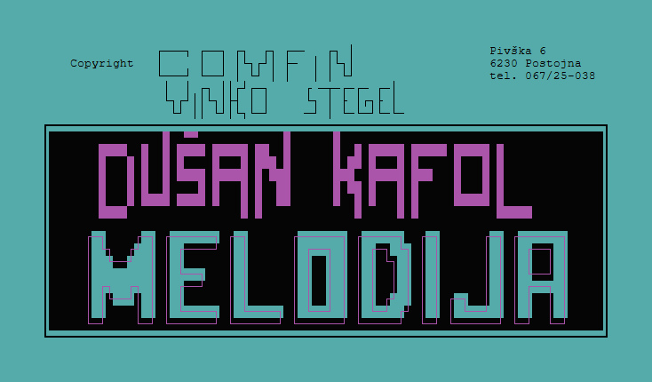

  

<h1 align="center">
  <a href="https://melodija.kafol.net/">melodija.kafol.net</a>
</h1>

# Melodija

Melodija je digitalni katalog zborovskih skladb, avtorjev, zborov in pripadajočih šifrantov. Namenjena je hitremu iskanju, urejanju in pregledovanju glasbenega gradiva, ki je bilo prvotno vodeno v starem DOS okolju.

Projekt temelji na izvirni aplikaciji, ki jo je razvil Vinko Stegel. Prvotna različica je bila napisana v jeziku COBOL okrog leta 1999 za Dušana Kafola, da je lahko vodil zbirko svojih 9000+ notnih zapisov pesmi in skladb.

Ta repozitorij vsebuje sodobno prepisano različico aplikacije. Podatki iz izvirnih datotek Micro Focus COBOL IDX/IND se preselijo v podatkovno zbirko SQLite, uporabniški vmesnik pa je na novo zgrajen kot spletna in namizna aplikacija.

## Tehnologije

- Vue 3 za uporabniški vmesnik
- Quasar za komponente in slovensko lokalizacijo vmesnika
- Vite za razvojni strežnik in gradnjo odjemalca
- Node.js za aplikacijski strežnik in programski vmesnik
- sql.js in SQLite za lokalno podatkovno zbirko
- Electron za namizno različico
- Docker za strežniško namestitev

## Vsebina

- `app/renderer` vsebuje sodobni uporabniški vmesnik.
- `app/server` vsebuje programski vmesnik, strežnik za spletno različico in delo s podatkovno zbirko.
- `app/electron` vsebuje namizni ovoj za Electron.
- `tools/migrate.py` preseli podatke iz izvirnih COBOL datotek.
- `cobol` hrani ohranjene izvorne in podatkovne datoteke iz stare aplikacije.
